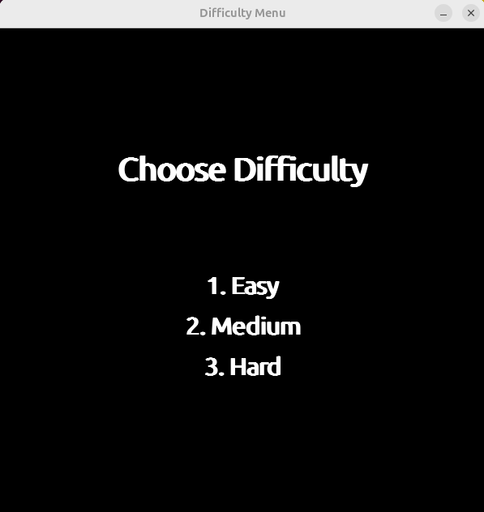
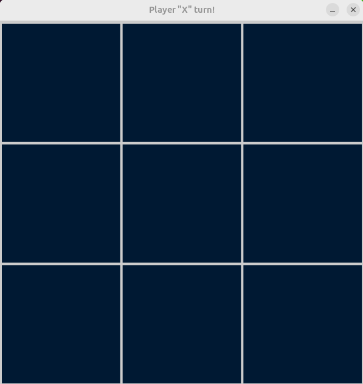
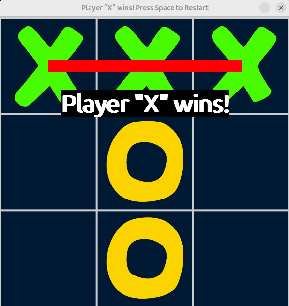
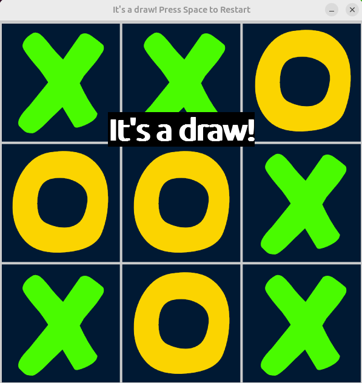

# Tic Tac Toe Game

This is a Python-based Tic Tac Toe game with a graphical interface built using Pygame. The game includes options for Player vs Player and Player vs Computer modes, with adjustable difficulty levels for the AI (Easy, Medium, Hard). This project is also Dockerized to simplify setup and make it easy for others to try out.


## Table of Contents
- [Features](#features)
- [Requirements](#requirements)
- [Setup and Installation](#setup-and-installation)
  - [Running Locally](#running-locally)
  - [Running with Docker](#running-with-docker)
- [Usage](#usage)
- [Game Screenshots](#game-screenshots)
- [Project Structure](#project-structure)
- [Files and Components](#files-and-components)
- [License](#license)

## Features

- **Player vs Player**: Play against another person on the same device.
- **Player vs Computer**: Play against the computer with adjustable difficulty.
- **Difficulty Levels**: Easy (random moves), Medium (basic AI), and Hard (AI using Minimax with alpha-beta pruning).
- **Dockerized**: Run the game in a Docker container for easy setup.
- **Responsive UI**: Real-time feedback and animations in the Pygame interface.

<a name="requirements"></a>
## Requirements

The project requires Python and the Pygame library to run locally. Alternatively, you can run it in a Docker container without additional dependencies. The `requirements.txt` file contains the Python dependencies.

## Setup and Installation

### Running Locally

1. **Install Python**: Make sure Python 3.12 or later is installed.
2. **Install Pygame**: Install the Pygame library and other dependencies with:
   ```bash
   pip install -r requirements.txt
   ```
3. **Run the Game**:
   ```bash
   python main.py
   ```

### Running with Docker

For Linux users, we’ve created a `run_game.sh` script to make it easy to start the game with Docker, including setting up X11 display forwarding.

1. **Install Docker**: Make sure Docker is installed on your machine.
2. **Pull the Docker Image**:
   ```bash
   docker pull szlatev/tic-tac-toe-game
   ```
3. **Run the Game**:
   - **On Linux**: Run the game with the provided script:
     ```bash
     ./run_game.sh
     ```
   - **On macOS and Windows**:
     - You’ll need an X11 server (XQuartz on macOS, VcXsrv on Windows).
     - Start the X11 server and run the following command:
       ```bash
       DISPLAY=host.docker.internal:0 docker run -it --rm -e DISPLAY=$DISPLAY -v /tmp/.X11-unix:/tmp/.X11-unix myusername/tic-tac-toe-game
       ```

> **Note**: For macOS and Windows users, it may be easier to install Python and Pygame directly rather than running the game in Docker, due to the complexity of setting up X11 forwarding.

## Usage

1. Launch the game to see the main menu.
2. Select "Player vs Player" or "Player vs Computer" by pressing `1` or `2`.
3. If "Player vs Computer" is selected, choose who should start (Player or Computer) by pressing `1` or `2`.
4. Choose the AI difficulty (Easy, Medium, or Hard) by pressing `1`, `2` or `3`.
5. Play the game by clicking on the grid. The game announces the winner or a draw when the game ends.
6. Press `ESCAPE` to return to the main menu or `SPACE` to restart the game.

## Game Screenshots

### Main Menu


### Player vs Computer Mode Selection


### Difficulty Selection


### Game Board


### Player Wins


### Draw


## Project Structure

Here is an overview of the main files and folders in the project:

```plaintext
├── ai.py              # AI logic for computer opponent
├── assets/            # Directory for images (X, O, field background)
├── Dockerfile         # Dockerfile to create Docker container
├── game_logic.py      # Game logic and Pygame interface handling
├── main.py            # Entry point for the game
├── README.md          # Project README
├── requirements.txt   # Python dependencies
└── run_game.sh        # Script to run the game on Linux with Docker
```

## Files and Components

### `main.py`

This file is the main entry point for the game. It initializes the Pygame environment, displays the main menu, and manages navigation between different game states.

### `game_logic.py`

Contains the main game logic for rendering the Tic Tac Toe board, handling player input, and checking for win conditions. This file also includes the different game states (e.g., main menu, difficulty selection, gameplay).

### `ai.py`

Implements the AI for the "Player vs Computer" mode. The AI difficulty levels are as follows:
- **Easy**: Chooses moves randomly.
- **Medium**: Tries to block the opponent and make winning moves.
- **Hard**: Uses the Minimax algorithm with alpha-beta pruning for optimal moves.

### `Dockerfile`

The Dockerfile defines the environment for running the game in a container. It installs the required libraries, copies the game files, and sets up Pygame dependencies.

### `requirements.txt`

Contains the Python dependencies required to run the game locally:
```
pygame==2.6.1
```

To install the dependencies, run:
```bash
pip install -r requirements.txt
```

### `run_game.sh`

A convenience script for Linux users to start the Docker container with the necessary X11 display configuration. This script allows Docker to access the display on the host, making it possible to run the GUI.

### `assets/`

This folder contains images for the game, including icons for X and O and the Tic Tac Toe board.

## License

This project is licensed under the MIT License. See the [LICENSE](./LICENSE) file for more details.